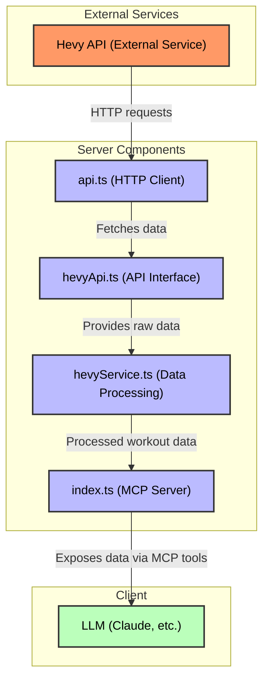

# Hevy MCP Server - Technical Documentation

This document contains technical information about the Hevy MCP Server, including installation, configuration, running the server, MCP tools, service methods, and project structure.

## Data Flow



## Installation

```bash
pn install
```

## Configuration

Copy the example environment file and update with your API keys:

```bash
cp .env.example .env
```

Then edit the `.env` file with your API credentials:

```
# Server Configuration
PORT=3000

# Hevy API Configuration
HEVY_API_BASE_URL=https://api.hevyapp.com/v1
HEVY_API_KEY=your_api_key_here
```

## Running the server

Start the compiled server:

```bash
pn start
```

Start with auto-restart during development:

```bash
pn dev
```

Build the TypeScript files:

```bash
pn build
```

The server will be available at http://localhost:3000

## Testing

Run the test suite:

```bash
pn test
```

Run tests in watch mode during development:

```bash
pn test:watch
```

Generate test coverage report:

```bash
pn test:coverage
```

## Testing the MCP Server

After building the server, you can test it using the MCP Inspector tool:

```bash
npx @modelcontextprotocol/inspector@0.6.0 node dist/index.js
```

This will launch an interactive UI where you can explore and test all available MCP tools in the server.

## MCP Tools

The following MCP tools are available for integration with LLMs:

### get-recent-workouts

```typescript
{
  limit: z.number().min(1).max(10).default(10).describe('Number of workouts to retrieve')
}
```

Returns user's recent workouts with duration, volume stats, and exercise details.

### get-exercise-progress-by-id

```typescript
{
  exerciseId: z.string().describe('ID of the exercise to retrieve progress for'),
  limit: z.number().min(0).max(10).default(10).describe('Number of latest workouts to retrieve')
}
```

Returns progress tracking for a specific exercise over time and all-time records.

### get-exercise-id-by-name

```typescript
{
  searchTerm: z.string().describe('Search exercises, which name contains the search term')
}
```

Returns exercise IDs that match the search term.

### get-exercise-ids-and-names

Returns a list of all exercise IDs and names available in the Hevy API.

### get-routines

Returns user's workout routines.

### get-favorite-exercises

Returns user's favorite exercises sorted by frequency.

## Services

### API Service

Located in `/src/services/api.ts`, this service provides methods for making HTTP requests:

- `get<T>(url, queryParams)`: Makes a GET request to the specified URL with optional query parameters

### Hevy API Service

Located in `/src/services/hevyApi.ts`, this service provides methods for interacting with the Hevy API:

- `getWorkouts(params)`: Gets workouts with pagination parameters, returns workouts and pagination info
- `getRoutines(params)`: Gets routines with pagination parameters, returns routines and pagination info
- `getExercises(params)`: Gets exercise templates with pagination parameters, returns exercises and pagination info
- `fetchFromHevy<T>(endpoint, params)`: Internal method that handles requests to the Hevy API with proper error handling and pagination

Response objects include both the requested data and pagination information (current page and total pages).

Example usage:
```typescript
import hevyApi from './services/hevyApi';

// Get all workouts with pagination info
const result = await hevyApi.getWorkouts({ page: 1, pageSize: 10 });
const workouts = result.workouts;
const currentPage = result.page;
const totalPages = result.pageCount;

// Get routines
const routinesResult = await hevyApi.getRoutines();
const routines = routinesResult.routines;

// Get exercise templates
const exercisesResult = await hevyApi.getExercises({ page: 1, pageSize: 10 });
const exercises = exercisesResult.exercises;
```

### Hevy Service

Located in `/src/services/hevyService.ts`, this service provides methods for processing and analyzing workout data:

- `calculateWorkoutStats(workout)`: Calculates statistics for a workout (duration, volume, etc.)
- `analyzeProgressForExercise(exerciseId)`: Analyzes progress for a specific exercise across multiple workouts
- `fetchAllWorkouts()`: Fetches all workouts by handling pagination
- `fetchAllExerciseTemplates()`: Fetches all exercise templates by handling pagination
- `fetchAllRoutines()`: Fetches all routines by handling pagination
- `getRecentWorkouts(limit)`: Gets recent workouts sorted by date
- `getWorkoutDetails(workoutId)`: Gets detailed information about a specific workout
- `getExerciseById(exerciseId)`: Gets exercise details by ID
- `searchExercisesByName(searchTerm)`: Searches exercises by name
- `getWorkoutsInTimeframe(startDate)`: Gets workouts within a specific timeframe
- `getFavoriteExercises()`: Gets favorite exercises sorted by frequency of use
- `populateCache()`: Populates the cache with initial data
- `calculateRecordsByReps(progressData)`: Calculates personal records by rep count

Example usage:
```typescript
import hevyService from './services/hevyService';

// Calculate workout stats
const stats = hevyService.calculateWorkoutStats(workout);
console.log(`Workout duration: ${stats.durationMinutes} minutes, Volume: ${stats.totalVolume} kg`);

// Get recent workouts
const recentWorkouts = await hevyService.getRecentWorkouts(5);

// Analyze progress for an exercise
const progress = await hevyService.analyzeProgressForExercise('ABC123');

// Get personal records
const records = hevyService.calculateRecordsByReps(progress);
console.log('Personal records:', records);

// Get favorite exercises
const favorites = await hevyService.getFavoriteExercises();
console.log('Most used exercises:', favorites);
```

## Project Structure

```
/
├── src/                # TypeScript source files
│   ├── index.ts        # Main server entrypoint
│   ├── config.ts       # Configuration file
│   ├── services/       # API services
│   │   ├── api.ts      # API fetch service
│   │   ├── hevyApi.ts  # Hevy API service
│   │   ├── hevyService.ts # Hevy data processing service
│   │   └── __mocks__/  # Mock services for testing
│   │   └── __tests__/  # Service tests
│   ├── utils/          # Utility functions
│   │   ├── index.ts    # Utility exports
│   │   ├── dateUtils.ts # Date manipulation utilities
│   │   ├── responseUtils.ts # API response formatting
│   │   ├── validation.ts # Input validation utilities
│   │   └── __tests__/  # Utility tests
│   ├── __tests__/      # Application tests
│   └── types/          # Type definitions
│       ├── index.ts    # Types barrel file
│       ├── Exercise.ts # Exercise interface and types
│       ├── ParamTypes.ts # Parameter types for tools
│       ├── Progress.ts # Progress tracking types
│       ├── QueryParams.ts # Query parameter types
│       ├── Routine.ts  # Routine interface
│       ├── Stats.ts    # Statistics types
│       └── Workout.ts  # Workout interface
├── dist/               # Compiled JavaScript (generated)
├── .env                # Environment variables (not in version control)
├── .env.example        # Example environment variables
├── package.json        # Dependencies and scripts
└── tsconfig.json       # TypeScript configuration
```