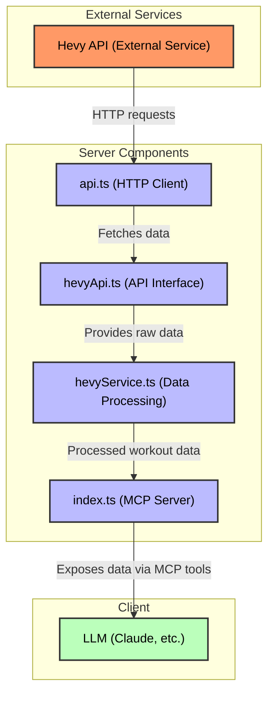

# Hevy MCP Server - Technical Documentation

This document contains technical information about the Hevy MCP Server, including installation, configuration, running the server, MCP tools, service methods, and project structure.

## Data Flow



## Installation

```bash
pn install
```

## Configuration

Copy the example environment file and update with your API keys:

```bash
cp .env.example .env
```

Then edit the `.env` file with your API credentials:

```
# Server Configuration
PORT=3000

# Hevy API Configuration
HEVY_API_BASE_URL=https://api.hevyapp.com/v1
HEVY_API_KEY=your_api_key_here
```

## Running the server

Start the compiled server:

```bash
pn start
```

Start with auto-restart during development:

```bash
pn dev
```

Build the TypeScript files:

```bash
pn build
```

The server will be available at http://localhost:3000

## Testing

Run the test suite:

```bash
pn test
```

Run tests in watch mode during development:

```bash
pn test:watch
```

Generate test coverage report:

```bash
pn test:coverage
```

## Testing the MCP Server

After building the server, you can test it using the MCP Inspector tool:

```bash
npx @modelcontextprotocol/inspector@0.6.0 node dist/index.js
```

This will launch an interactive UI where you can explore and test all available MCP tools in the server.

## Publishing

The project uses semantic-release for automated versioning and publishing. Publishing is done manually and requires proper authentication setup.

### Authentication

Add the following tokens to your `.env` file:

```
NPM_TOKEN=your_npm_token_here
GITHUB_TOKEN=your_github_token_here
```

### Release Types

Different types of releases are created based on the branch you're working on:

- **Feature Branches**: Must use the prefix `feat/` (e.g., `feat/new-feature`)
- **Bug Fix Branches**: Must use the prefix `bug/` (e.g., `bug/fix-issue`)
- **Production Releases**: Can only be published from the `main` branch

Release process:
- Production releases are published manually from the `main` branch by the maintainer
- Alpha releases can be manually triggered from `feat/*` and `bug/*` branches using:
  ```bash
  pn publish:alpha
  ```

> Note: Support for beta releases is currently work in progress.

The versioning is determined automatically based on your commit messages and the branch name.

## MCP Tools

The following MCP tools are available for integration with LLMs:

### get-workouts

```typescript
{
  limit: z.number().min(1).max(10).default(10).describe('Number of workouts to retrieve'),
  startDate: z.string().optional().describe('Optional: ISO date string to filter workouts after this date'),
  endDate: z.string().optional().describe('Optional: ISO date string to filter workouts before this date')
}
```

Returns user's workouts with duration, volume stats, and exercise details. Results are returned in descending order of date.

### get-exercise-progress-by-ids

```typescript
{
  exerciseIds: z.array(z.string()).describe('IDs of the exercises to retrieve progress for'),
  limit: z.number().min(0).max(10).default(10).describe('Number of latest workouts to retrieve'),
  startDate: z.string().optional().describe('Optional: ISO date string to filter workouts after this date'),
  endDate: z.string().optional().describe('Optional: ISO date string to filter workouts before this date')
}
```

Returns progress tracking for specific exercises over time, filtered by date range.

### get-exercises

```typescript
{
  searchTerm: z.string().optional().describe('Optional: Search term to filter exercises by name'),
  excludeUnused: z.boolean().optional().default(true).describe('If true, exclude exercises with zero frequency (never done)'),
  startDate: z.string().optional().describe('Optional: ISO date string to filter workouts after this date'),
  endDate: z.string().optional().describe('Optional: ISO date string to filter workouts before this date')
}
```

Returns comprehensive exercise data sorted by frequency of use, with optional filtering by name and date range.

### get-routines

Returns user's workout routines.

## Services

### API Service

Located in `/src/services/api.ts`, this service provides methods for making HTTP requests:

- `get<T>(url, queryParams)`: Makes a GET request to the specified URL with optional query parameters

### Hevy API Service

Located in `/src/services/hevyApi.ts`, this service provides methods for interacting with the Hevy API:

- `getWorkouts(params)`: Gets workouts with pagination parameters, returns workouts and pagination info
- `getRoutines(params)`: Gets routines with pagination parameters, returns routines and pagination info
- `getExercises(params)`: Gets exercise templates with pagination parameters, returns exercises and pagination info
- `fetchFromHevy<T>(endpoint, params)`: Internal method that handles requests to the Hevy API with proper error handling and pagination

Response objects include both the requested data and pagination information (current page and total pages).

Example usage:
```typescript
import hevyApi from './services/hevyApi';

// Get all workouts with pagination info
const result = await hevyApi.getWorkouts({ page: 1, pageSize: 10 });
const workouts = result.workouts;
const currentPage = result.page;
const totalPages = result.pageCount;

// Get routines
const routinesResult = await hevyApi.getRoutines();
const routines = routinesResult.routines;

// Get exercise templates
const exercisesResult = await hevyApi.getExercises({ page: 1, pageSize: 10 });
const exercises = exercisesResult.exercises;
```

### Hevy Service

Located in `/src/services/hevyService.ts`, this service provides methods for processing workout data:

- `getWorkouts(startDate?, endDate?)`: Gets workouts filtered by optional date range
- `getExercises(searchTerm?, excludeUnused?, startDate?, endDate?)`: Gets exercises with optional filtering
- `calculateWorkoutStats(workout)`: Calculates duration and volume stats for a workout
- `processExerciseProgress(exercise, workouts, limit)`: Processes exercise progress data
- `fetchAllRoutines()`: Gets all user's workout routines
- `fetchAllExerciseTemplates()`: Gets all exercise templates
- `populateCache()`: Populates the initial cache on server startup

The service handles data processing, caching, and provides formatted responses for the MCP tools.

## Project Structure

```
/
├── src/                # TypeScript source files
│   ├── index.ts        # Main server entrypoint
│   ├── config.ts       # Configuration file
│   ├── services/       # API services
│   │   ├── api.ts      # API fetch service
│   │   ├── hevyApi.ts  # Hevy API service
│   │   ├── hevyService.ts # Hevy data processing service
│   │   └── __mocks__/  # Mock services for testing
│   │   └── __tests__/  # Service tests
│   ├── utils/          # Utility functions
│   │   ├── index.ts    # Utility exports
│   │   ├── dateUtils.ts # Date manipulation utilities
│   │   ├── responseUtils.ts # API response formatting
│   │   ├── validation.ts # Input validation utilities
│   │   └── __tests__/  # Utility tests
│   ├── __tests__/      # Application tests
│   └── types/          # Type definitions
│       ├── index.ts    # Types barrel file
│       ├── Exercise.ts # Exercise interface and types
│       ├── ParamTypes.ts # Parameter types for tools
│       ├── Progress.ts # Progress tracking types
│       ├── QueryParams.ts # Query parameter types
│       ├── Routine.ts  # Routine interface
│       ├── Stats.ts    # Statistics types
│       └── Workout.ts  # Workout interface
├── dist/               # Compiled JavaScript (generated)
├── .env                # Environment variables (not in version control)
├── .env.example        # Example environment variables
├── package.json        # Dependencies and scripts
└── tsconfig.json       # TypeScript configuration
```